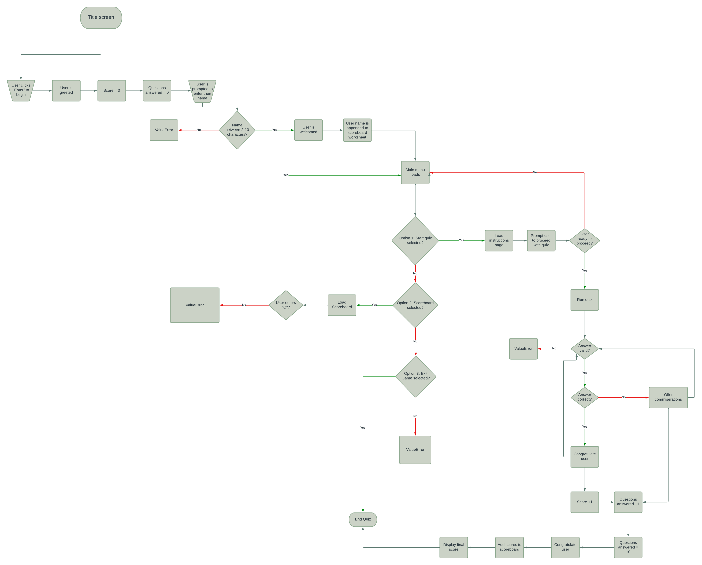
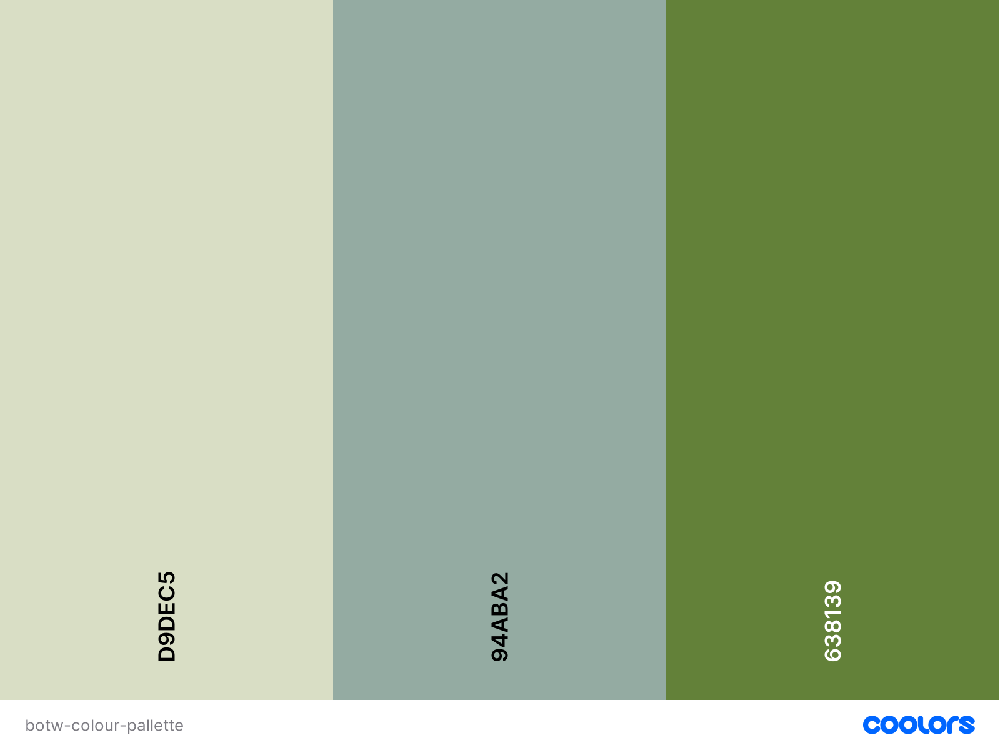
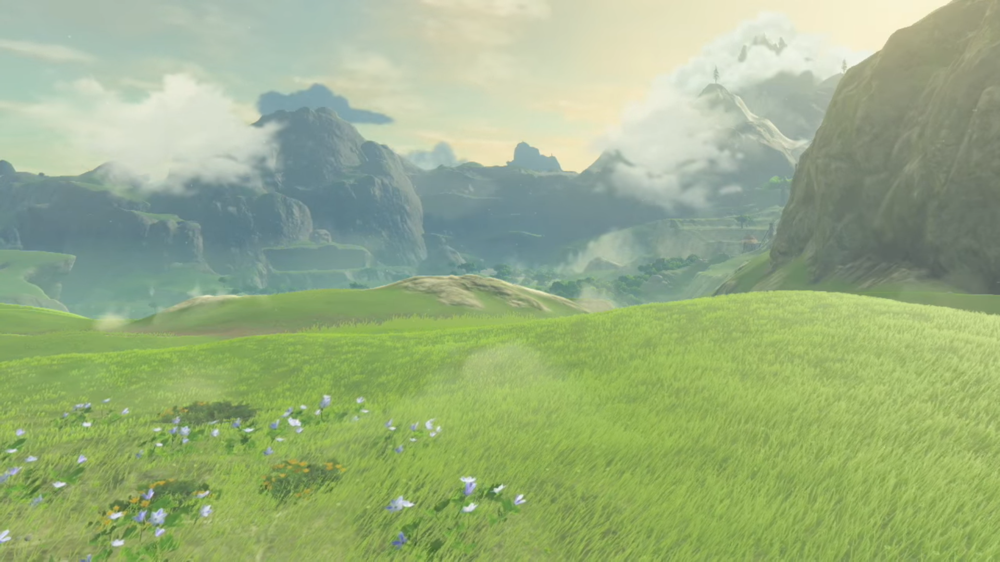

# The Legend of Zelda: Breath of the Wild Quiz

## Description 

Welcome to botw-quiz, a Python terminal based multiple choice quiz inspired by the iconic Nintendo Switch game, The Legend of Zelda: Breath of the Wild!

## How to play

The quiz itself consists of 10 questions in total based on the lore & gameplay mechanics of The Legend of Zelda: Breath of the Wild. 

The user will have a choice of 4 answers for each question. 

Each correct answer equates to 1 point towards the final score.

Once all 10 questions have been answered, the final score will be provided to the user, and the user’s name & final score will be added to the scoreboard, which can be accessed via the main menu. 

## Design

### Flowchart 

The flowchart above was created during the planning phase of the project. 
A few aspects were changed during the production of the quiz. 

- Instead of prompting the user to click "Enter" to proceed on the title screen, the user is now automatically directed to the main menu 5 seconds after the program starts running. 
    - I felt that it would negatively impact the user experience if an error was thrown if the user happened to press a key that is not "Enter". 
- The username is now appended to the scoreboard at the end of the quiz, rather than at the start. 
    - This was done to ensure that there would be no blank scores next to any of the names on the scoreboard. 
- The user now has the option to play again or exit the quiz once all questions have been answered. 

### Colours

#### ANSI colours

ANSI colours were imported from the colorama library.

- Yellow: used for aesthetic purposes to print the quiz logo & triforce ASCII art.
- Green: used to provide visual feedback to the user when they select a correct answer.
- Red: used to provide visual feedback to the user when they select an incorrect answer.

#### HEX colours

Slight modifications were made to the Code Institute Mock Terminal for aesthetic purposes & to match the theme of the quiz. 

- #d9dec5: Used as a fallback background colour. 
- #94aba2: Used as a border colour for the "RUN QUIZ" button to add contrast.
- #638139: Used to colour the "RUN QUIZ" button. 

The colour pallette was generated from the background image below. 

### Imagery

The image above, featuring a glimpse of the vast kingdom of Hyrule, was added as a background image to compliment the theme of the quiz. 

## Features

### Existing Features

### Future Features

## Technologies Used

### Languages

- Python was used to program the quiz.
- HTML & CSS were used to make adjustments to the Code Institute mock terminal for Heroku.

### Frameworks, Libraries & Programs

- [CodeAnywhere](https://app.codeanywhere.com/): to write the code.
- [Git](https://git-scm.com/): to commit & push the code to GitHub for version control.
- [GitHub](https://github.com/): to store the code in its repository.
- [Heroku](https://id.heroku.com/login): to deploy the app.
- [Imgur](https://imgur.com/): to host the background image. 
- [ImageColorPicker](https://imagecolorpicker.com/en): used to generate colours from the background image for the “RUN QUIZ” button.
- [gspread](https://docs.gspread.org/en/v5.10.0/): to access & manipulate the data stored in the [botw-quiz](https://docs.google.com/spreadsheets/d/1nyocvizezU-y-m0PedQcAAGDziM1yjVJAMwC1k_DBCg/edit#gid=0) Google Sheet.
- [os](https://docs.python.org/3/library/os.html): to create a function that clears the terminal once the function is called for better readability.
- [tabulate](https://pypi.org/project/tabulate/): to print the scoreboard data to the terminal in a table format for aesthetic and readability purposes. 
- [time](https://docs.python.org/3/library/time.html): to delay functions/actions from being executed to prevent the user from being overloaded with information.
- [sys](https://docs.python.org/3/library/sys.html): to allow for text to be printed slowly once the slow_print() function is called. For better readability & to emulate updates within the program. 
- [colorama](https://pypi.org/project/colorama/): to print coloured text to the terminal for aesthetic purposes and to enhance the visual feedback once questions are answered correctly/incorrectly. 

## Testing

The testing details are documented within the [TESTING.md](TESTING.md) file. 

## Deployment

This project was deployed to Heroku using Code Institute's mock terminal.

- Steps for deployment: 
    - Fork or clone this repository.
    - Create a new Heroku app.
    - Set a buildback to Python and NodeJS in that order.
    - Set another buildback to Port and 8000.
    - Link the Heroku app to the repository.
    - Click on “Deploy”.

## Credits

### Code

- [Stack Overflow](https://stackoverflow.com/questions/40056747/print-a-list-of-dictionaries-in-table-form) was consulted for guidance on how to print the scoreboard data to the terminal in the form of a table using Tabulate.
- Credit to [gnuton](https://gist.github.com/gnuton/3c7a46447d2be0aee0b2) on Github for the code that within the "slow_print()" function.
- [Fsymbols](https://fsymbols.com/generators/carty/) was used to generate the ASCII text for the Main Menu, Scoreboard & Instructions pages.
- [Python Pool](https://www.pythonpool.com/python-colorama/) was consulted for guidance on how to print coloured text to the terminal using Colorama.
- The “logo” ASCII art was obtained from [asciiart.eu](https://www.asciiart.eu/video-games/zelda) & modified by me to fit the terminal.
- The “triforce” ASCII art was obtained from [emojicombos.com](https://emojicombos.com/legend-of-zelda-ascii-art).
- The code within the “clear_terminal()” function was provided by my mentor, Derek McAuley. 

### Media

- The background image was sourced from [Imgur](https://imgur.com/xs0uO5R).

### Content

- The quiz questions & answers were written by me, based on the Nintendo Switch game The Legend of Zelda: Breath of the Wild. 
- [wikipedia.org](https://en.wikipedia.org/wiki/The_Legend_of_Zelda:_Breath_of_the_Wild) & [zelda.fandom.com](https://zelda.fandom.com/wiki/The_Legend_of_Zelda:_Breath_of_the_Wildhttps://zelda.fandom.com/wiki/The_Legend_of_Zelda:_Breath_of_the_Wild) were consulted for inspiration for the questions & answers.

### Acknowledgements

- Special thanks to my mentor Derek McAuley for his support with the project, particularly with helping me to troubleshoot an issue I was having with deployment  and for providing guidance on throwing exceptions and printing ASCII art to the terminal for a more visually appealing program. Derek also provided me with code to clear the terminal, which is compatible on multiple operating systems. 
- I would also like to thank Oisin from the tutor support team for helping me to troubleshoot an issue I had with iterating through the questions & answers for the quiz. 