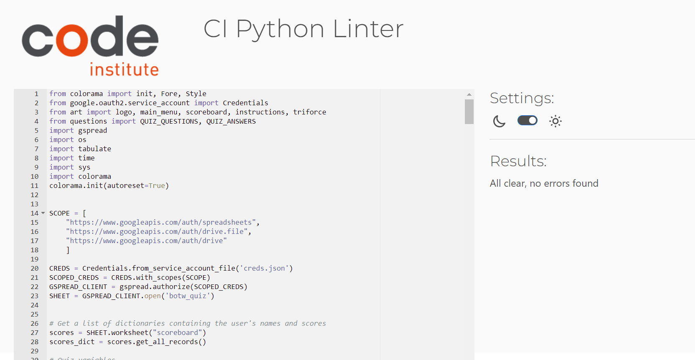
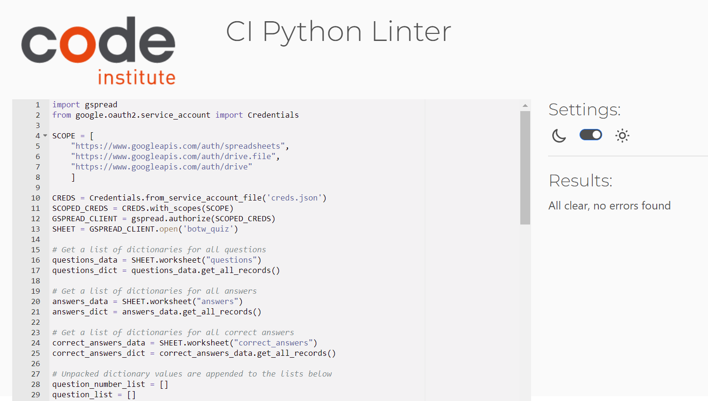
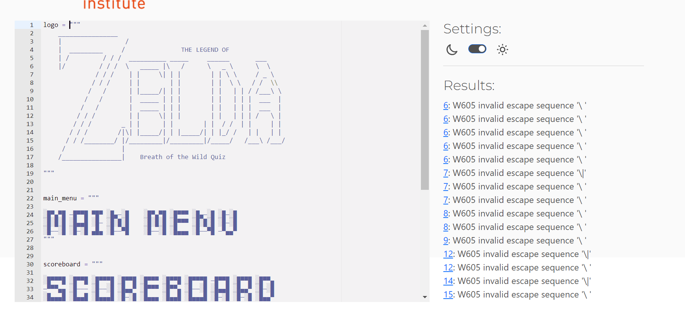
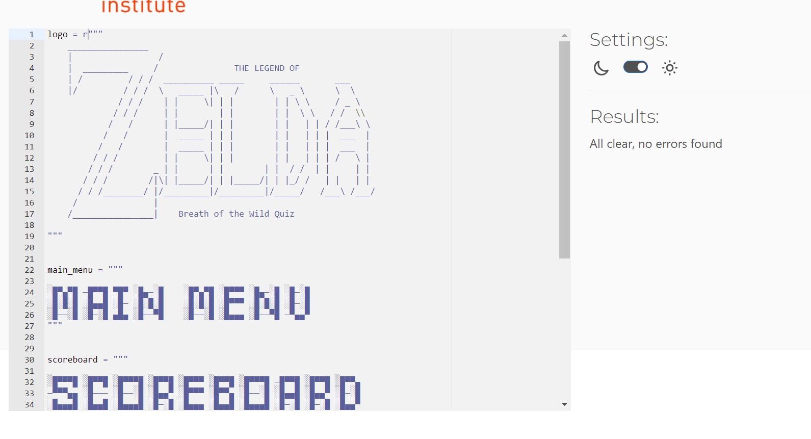
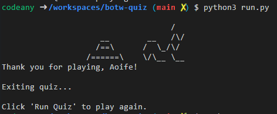
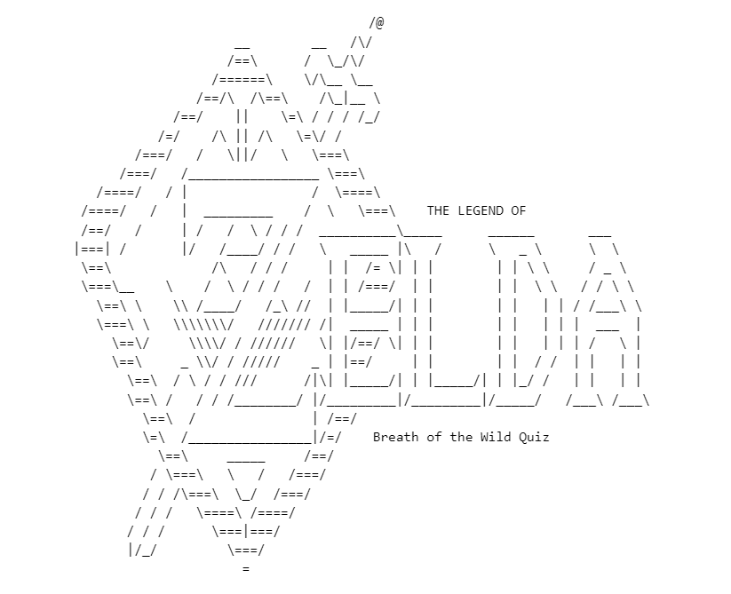
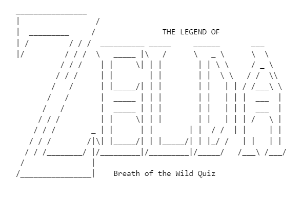

# Testing - The Legend of Zelda: Breath of the Wild Quiz 

## Manual Testing

The following scenarios were tested locally on CodeAnywhere and on the deployed Heroku app. 

Title Screen

|  Scenario | Status  |
|---|---|
|Once the program starts, the logo is printed to the terminal.   | Pass  |
| 5 seconds after the program starts, the user is prompted to enter their name.  |  Pass |

Username Input

|  Scenario | Status  |
|---|---|
| Once the user enters their name in the input field, the terminal is cleared & "Welcome, *username*!" is printed to the terminal | Pass   |
| The global "username" variable is update once the user enters their name.  | Pass |
| The main menu automatically loads 3 seconds after the user provides a username. | Pass |
| A ValueError is thrown if the user enters a name less than 2 characters long.  |  Pass |
| A ValueError is thrown if the user attempts to enter a blank username.  | Pass  |
| A ValueError is thrown if the user enters a name greater than 10 characters long. | Pass  |

Main Menu

|  Scenario | Status  |
|---|---|
|When user enters option “1”, the instructions page is loaded. | Pass |
| When user enters option “2” on the main menu, the scoreboard page is loaded | Pass  |
| When the user enters option “3”, the Triforce logo & thank you message is printed to the terminal, and the program stops running. | Pass | 
| A ValueError is thrown if the user enters a value other than 1, 2 or 3 on the main menu, and the user in prompted to try again.  | Pass |

Scoreboard page

|  Scenario | Status  |
|---|---|
| The user's names & scores are printed in a table format. | Pass | 
| The user is redirected to the main menu when they enter “Q” from the main menu, regardless of whether they enter it in uppercase or lowercase. | Pass  |

Instructions page

|  Scenario | Status  |
|---|---|
| Quiz instructions are printed to the terminal. | Pass |
| When the user enters option “Y” on the instructions page in uppercase or lowercase, the quiz begins.   | Pass |
|When the user enters option “N” on the instructions page in uppercase or lowercase, they are redirected to the main menu.   | Pass  |
| A ValueError is thrown if the user enters a value other than “Y” or “N”.  | Pass |

Quiz

|  Scenario | Status  |
|---|---|
| Once the quiz begins, the questions & answers are printed to the terminal, and the user is prompted to enter an answer (A, B, C or D).  |  Pass |
| If the user selects the correct answer, “Correct!” is printed to the terminal in green.  |  Pass |
| Score is incremented by 1 when the user selects the correct answer.   |  Pass |
| If the user selects an incorrect answer, “Not quite! The correct answer was option: "*correct option*” is printed to the terminal in red.   | Pass  |
| Score is not incremented by 1 when the user selects a wrong answer.  |  Pass |
| If the user inputs a value other than A, B, C or D while the quiz is running, a ValueError will be thrown & the user will be prompted to try again.   | Pass |
| 2 seconds after the user answers a question, the terminal is cleared & the next question is loaded.  | Pass  |
| The questions_answered variable is incremented by 1 each time the user answers a question. | Pass |

End of quiz

|  Scenario | Status  |
|---|---|
| Once all 10 questions have been answered, the terminal is cleared & final score is given.   | Pass  |
| If the user answered all 10 questions correctly, "Congratulations, *username*! You have well and truly proven yourself as a hero of Hyrule!" is printed to the terminal." | Pass  |
| If the user answered 7-9 questions correctly, ""Well done, *username*! You are well on your way to proving yourself as a hero of Hyrule." is printed to the terminal.  | Pass  |
| If the user answered 5-6 questions correctly, "Not bad, *username*. With a little more exploration you will be well on your way to proving yourself as a hero of Hyrule!  | Pass  |
| If the user answered 0-4 questions correctly, "Thank you for playing, *username*. Your final score is: *score*. We hope that you see this as an opportunity to delve deeper into the vast kingdom of Hyrule!"  | Pass  |
| Once all 10 questions have been answered, the user’s name is saved to the scoreboard worksheet.   | Pass  |
| Once all 10 questions have been answered, the user’s final score saved to the scoreboard worksheet.   |  Pass |
| 3 seconds after the scoreboard is updated, the terminal is cleared and the user is prompted to confirm whether or not they want to play again.   | Pass  |

Play again screen

|  Scenario | Status  |
|---|---|
| If the user enters option “Y”, the terminal will clear & the quiz will run again.  | Pass  |
| If the user enters option “Y”, the global score variable will revert to 0.   |  Pass  |
| If the user enters option “Y”, the global questions_answered variable will revert to 0.  | Pass  |
| The "End of quiz" scenarios will perform run again as normal. | Pass |
| A ValueError is thrown if the user enters a value other than “Y” or “N”.  | Pass |

## Validator Testing

### PEP8

Each of the Python files were run through the CI Python Linter.

- [run.py](run.py)

Passed with no issues.

- [questions.py](questions.py)

Passed with no issues.

- [art.py](art.py)

Initially, "W605 invalid escape sequence \" errors were thrown when I validated the code. 

To resolve this, I declared "logo" as a raw string instead of as a docstring. 

## Bugs

| Issue  | Notes  | Status  |
|---|---|---|
| A for loop was set up to iterate through an unpacked list of dictionaries that was pulled from the botw-quiz Google Sheet. All questions, answers and answer options were stored within 1 worksheet. When the code was executed, the last question and accompanying set of answers was being printed to the terminal, and was being repeated every time a question was answered.   | Separated the questions & answers into separate worksheets. Accessed values from each worksheet. Created a list of dictionaries containing questions as keys and correct answer options as values. Created a list of lists containing the answer options. Created a new for loop to iterate through the list of dictionaries & list of lists at the same time.  |  Resolved |
| Part of the logo from the title page remained printed to the terminal, even after the clear_terminal() function was called.   | In order to prioritise the smooth running of the program, I removed the background from the ASCII text to reduct its overall size.    | Resolved |
